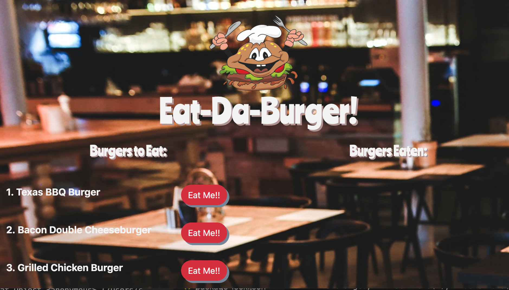

# "Eat-Da-Burger" App
[](https://bwaycarl.github.io/Portfolio/)
[](https://github.com/BwayCarl/burger/blob/master/LICENSE)
[](https://github.com/BwayCarl/burger/issues)
[](https://github.com/BwayCarl/burger/network)
[](https://github.com/BwayCarl/burger/stargazers)
## Homework Assignment - Week 13
#### Rutgers Coding Bootcamp / RUT-JER-FSF-PT-06-2020-U-C

## *Table of Contents*
- [Description](#description)
- [Installation](#installation)
- [Usage](#usage)
- [Contributing](#contributing)
- [Authors](#authors)
- [Screenshots](#screenshots)
- [Contact Me](#contact-me)
- [License](#license)

## *Description* 
A burger logger using MySQL, Node, Express, Handlebars and a homemade ORM following the MVC design pattern; uses Node and MySQL to query and route data in the app, and Handlebars to generate the HTML.

## *Installation* 
 - After cloning the repo, enter your MySql password in the `config/connection.js` file.
 
 - Run ```npm install``` from your terminal to install the necessary dependencies:
 
    - ```express ```

    - ```express-handlebars ```

    - ```jquery```

    - ```mysql ```

- Create your MySQL database with the schema and seeds provided in the ```db``` folder.

 - Run ```node server.js``` from your terminal and use ```localhost:8080``` in your browser.


## *Usage*
You can use this app using this **[Heroku Link.](https://radiant-tor-88185.herokuapp.com/burgers)**

## *Contributing* 
 Feel free to contribute. Just contact me and fork away!

## *Authors* 
 Carlos Martinez

 Templates and libraries provided by Rutgers Bootcamp as a starting point for the assignment.

## *Screenshots* 


## *Contact Me*
 - Github: **[BwayCarl](https://github.com/BwayCarl)**
 - LinkedIn: **[Carlos Martinez](https://www.linkedin.com/in/carlos-martinez-8702b146/)** 
 - Twitter: **[@BwayCarlDev](https://twitter.com/BwayDev)**
 - Email: **[bwaycarl@gmail.com](mailto:bwaycarl@gmail.com)**

## *License* 
This project is [MIT](https://github.com/BwayCarl/burger/blob/master/LICENSE) Licensed.
 
 &copy; 2020, Carlos Martinez
